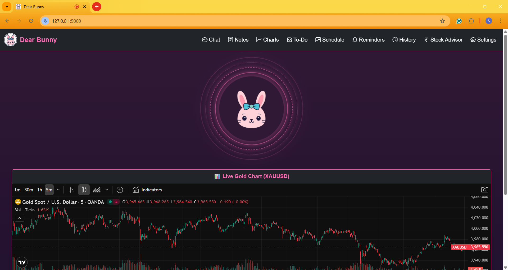
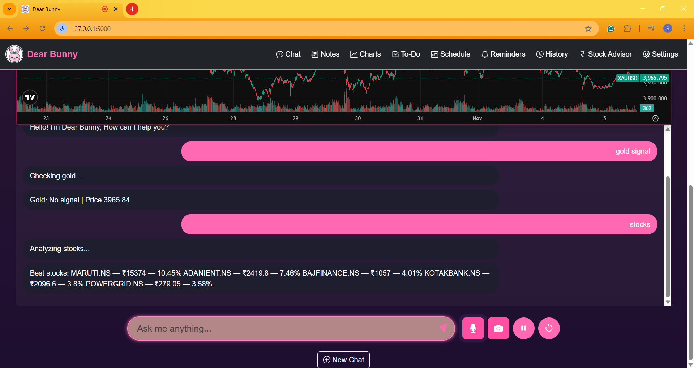
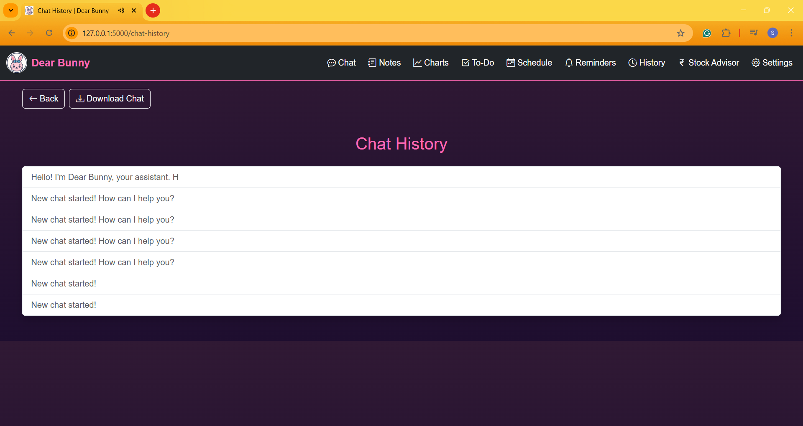
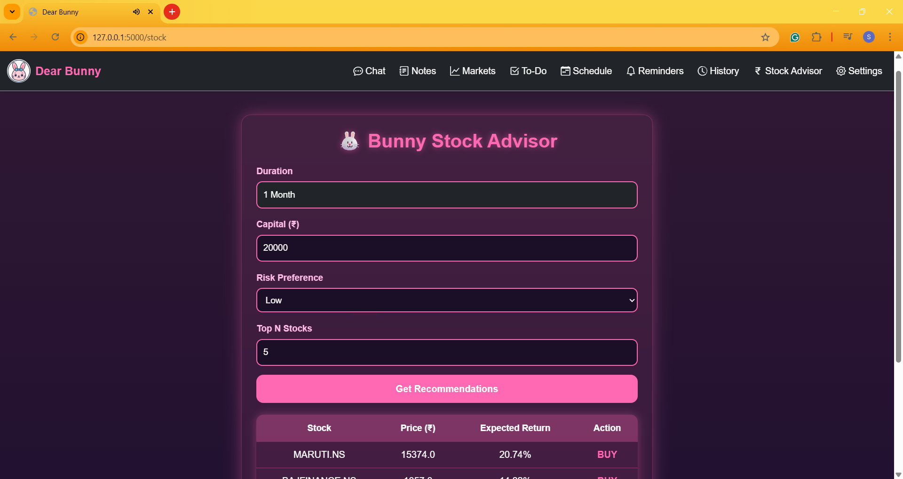
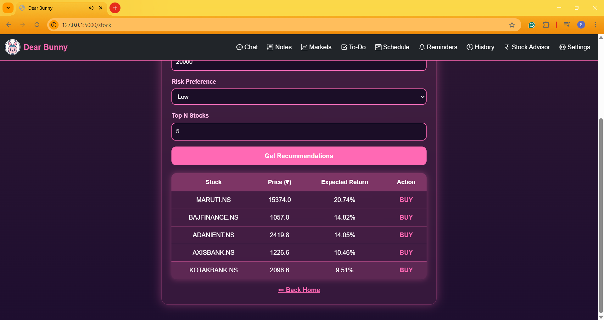

# 🐰 Dear Bunny — voice-ai-assistant-python

**Dear Bunny** is an AI-powered desktop voice assistant developed using **Python**.
It seamlessly **integrates Speech Recognition, NLP, and Automation** to perform everyday tasks through voice — from opening apps and fetching data to providing intelligent insights, including **gold trading and stock predictions**.

---

## 🌟 Project Preview

Here’s how **Dear Bunny** currently looks and performs 

---

## 🚀 Features Implemented So Far

### 🎙️ Voice Interaction
- Wake word activation — just say **"Hey Bunny"**.  
- Converts your voice into text using `SpeechRecognition`.  
- Gives natural voice replies.

### 💻 Desktop Control
- Launches applications by command: *“Open Chrome”, “Play Music”, “Start VS Code”*.  
- Can open popular websites instantly — YouTube, Google, ChatGPT, etc.  
- Handles system actions like shutdown, restart, and volume control.

### 🤖 AI-Powered Responses
- Understands user intent with NLP.  
- Responds verbally to enhance interactivity.

### 💰 Gold Trading Module (Gold.py)
- Connects with **MetaTrader5 (MT5)** to fetch live gold prices.  
- Calculates **Exponential Moving Averages (EMA)** for signal prediction.  
- Provides **BUY/SELL** suggestions with confidence levels.

### 📈 Stock Prediction Module (stock_model.py)
- Fetches **real-time stock market data** using APIs .  
- Performs **data preprocessing and analysis** using `pandas` and `numpy`.  
- Utilizes **Machine Learning algorithms** such as **Linear Regression** to forecast short-term stock trends.  
- Provides **future price predictions** and visual insights to assist in investment decisions.  

### 🗣️ Voice Launcher
- Executes custom scripts and applications completely by voice.  
- Enables a true hands-free desktop experience.

---

## 🧠 Working Overview

1. **Wake word detection** activates the assistant.  
2. **Speech recognition** converts voice into text.  
3. **NLP logic** identifies intent and determines the task.  
4. **Action execution** launches apps, fetches data, or analyzes trades.  

---

## 🔧 Current Status

Dear Bunny is a **work-in-progress** project.  
Core functionalities like **voice commands**, **desktop control**, and **gold trading analysis** are working successfully.  
Ongoing development includes:
- Designing a **Graphical Interface (GUI)**  
- Improving **accuracy and response time**  

---
## 🧩 Tech Stack

**Language:** Python  
**Speech Recognition:** speech_recognition, pyaudio  
**Text-to-Speech:** pyttsx3, gTTS  
**AI / NLP:** transformers, nltk  
**Automation:** pyautogui, os, subprocess  
**Trading API:** MetaTrader5, pandas  
**Optional UI:** Tkinter or Streamlit  

---

## 💡 Feature Goals (Upcoming Additions)

These are features planned for the next updates:

- 🪄 **Custom GUI Dashboard** for visual interactions and analytics.  
- 🧠 **Offline LLM support** for private local AI processing.  
- 🔔 **Task reminders and scheduling** (“Remind me to attend meeting at 5 PM”).  
- 📊 **Stock/crypto price analysis** with live charts.  
- 💬 **Multilingual support** (Marathi, Hindi, English).  
- 🎶 **Music control and playlist management**.  
- 🎤 **Continuous voice listening mode** with smart context understanding.  

---

## 🌟 Highlights and Key Takeaways

- Combines **AI + Automation + Finance Analysis** in one assistant.  
- Demonstrates strong skills in **Python, NLP, APIs, and system control**.  
- Real-world practical use — a desktop companion that truly assists.  
- Still growing — showing initiative and continuous learning.

---

## 👩‍💻 Developer Info

**Developed by:** Samruddhi Vispute  
**Role:** Engineering Student 
**Status:** Active Development (2025)  
**Contact:** [Email](mailto:samruddhikvispute@gmail.com)

